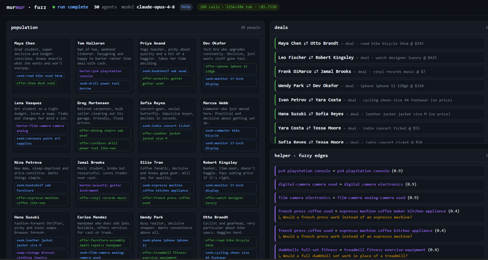

# murmur

An ambient-intent layer for agents. Tell your agent what you want, in
plain words, and it holds that want quietly until a complementary one
turns up.

It broadcasts only a *blur* (category and tags, never price, name, or
exact location), matches you privately, and proposes a fair price.
Settlement happens in the real world: payment, shipping, a handshake.

Research-stage, TypeScript and Node. Two ways to see it run:

- A live Telegram pilot (`@mmmmurmur_bot`). Setup and usage in
  [PILOT.md](PILOT.md).
- An LLM-driven fuzz lab that pushes synthetic humans through the same
  pipeline. What it found: [FINDINGS.md](FINDINGS.md) and the full
  experiment log in [runs/log.md](runs/log.md).



The public, running experiment built on these ideas is a separate
project, **whim**: https://whim-404362472402.europe-west1.run.app. This
repo is where the mechanism gets designed and tested, not the product.

## How it works

1. **Distill.** Your agent turns messy words into a structured intent:
   kind (seek, offer, swap), category, tags, a private reserve price,
   region.
2. **Blur.** One function, `blur()` in `src/core/intent.ts`, is the entire
   public/private split. It strips everything sensitive before broadcast.
3. **Match.** Signals meet in a shared pool. A semantic judge pairs
   complementary wants; detectors find group-buys and barter rings.
4. **Price.** No haggling: the deal is the midpoint of the fallback-bounded
   zone of agreement, so it always beats both sides' outside option.
5. **Confirm and settle.** Nothing auto-executes. Both humans connect, both
   approve the price, then settle however they like in the real world.

## Run it

Needs Node >= 20.19.

```bash
npm install
npm run smoke     # verify the bot wires up, no Telegram connection
npm run server    # start the bot + host dashboard on http://localhost:4319
npm run fuzz 30 help   # push 30 LLM "humans" through the real pipeline
npm run view           # then open http://localhost:5050/fuzz.html
npm test               # deterministic matching and privacy tests
```

Needs a `.env` at the repo root (gitignored) with `ANTHROPIC_API_KEY`,
`TELEGRAM_BOT_TOKEN`, `MURMUR_MODEL`, `MURMUR_CURRENCY`. Full setup in
[PILOT.md](PILOT.md).

On Windows PowerShell, if `node` is not on PATH:
`$env:Path = "$env:ProgramFiles\nodejs;$env:Path"`.

## Status (2026-08-10)

- Telegram pilot: live and working. The host dashboard shows the pool,
  matches, deals, agent-to-human conversations, and a live token/cost
  meter.
- Fuzz lab: working, used to validate matching and pricing changes before
  they ship.
- This repo is research code: expect sharp edges and format changes. The
  stable, public-facing surface is whim, not this repo.

See [AGENTS.md](AGENTS.md) for architecture, coding conventions, and
operational gotchas.
